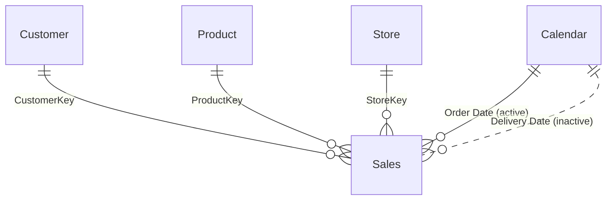

# Beispielprojekt_sales Semantic Model

## Overview

The model supports sales analysis across products, customers, stores, and time. Its central `Sales` table contains line-level order data and is related to four descriptive tables. The model includes sales, margin, cost, customer, and product/store-count measures.

| Property | Value |
|---|---|
| Source | `Beispielprojekt_sales.SemanticModel/` |
| Storage mode(s) | Import (all five table partitions) |
| Tables | 5 |
| Measures | 13 |
| Relationships | 5 (4 active, 1 inactive) |

## Model Structure



`Sales` is the transactional table; `Customer`, `Product`, `Store`, and `Calendar` provide analysis attributes. The customer, product, and store keys and the calendar order-date link are active. The delivery-date relationship is inactive, so the default calendar relationship filters sales by order date; measures must explicitly activate the delivery-date relationship to analyze delivery dates. The TMDL does not specify bidirectional cross-filtering.

The calendar supports a continuous date range from 2017-01-01 through 2021-12-31. The company context describes a February–January fiscal year, but this model's M expression calculates fiscal years with a July boundary. Its fiscal-quarter expression also evaluates to labels FQ2 through FQ5 over calendar months. Validate and align these fields before relying on them for fiscal reporting.

## Tables and Columns

Visibility reflects the model metadata. Descriptions below summarize the field names and their roles; source metadata does not provide separate business descriptions.

### Calendar

One row per date, generated in Power Query for 2017–2021.

| Column | Data type | Visibility | Description |
|---|---|---|---|
| Date | Date/time | Hidden | Calendar date and relationship key. |
| Year | Whole number | Visible | Calendar year. |
| Quarter | Text | Visible | Calendar quarter label. |
| Month | Whole number | Hidden | Month number; supports month sorting. |
| Month Name | Text | Hidden | Abbreviated month name. |
| Year-Month | Date/time | Visible | Month-level date used for time-series analysis. |
| Day | Whole number | Visible | Day of month. |
| Week Number | Whole number | Visible | Week number from Power Query's week-of-year function. |
| Day of Week | Whole number | Visible | Day-of-week number. |
| Day Name | Text | Visible | Day name, sorted by day number. |
| Is Weekend | Boolean | Hidden | Weekend flag. |
| Fiscal Year | Whole number | Hidden | Year calculated with a July fiscal-year boundary. |
| Fiscal Quarter | Text | Visible | Quarter label generated by the model's fiscal-quarter expression; see the fiscal-calendar caveat above. |

The table also defines a `Year-Month-Day` hierarchy (Year, Month, Day).

### Customer

One row per customer; customer attributes support demographic and geographic breakdowns.

| Column | Data type | Visibility | Description |
|---|---|---|---|
| CustomerKey | Whole number | Hidden | Customer key and relationship key. |
| Customer | Text | Visible | Customer name. |
| Gender | Text | Visible | Customer gender. |
| Address | Text | Visible | Customer address. |
| City | Text | Visible | Customer city. |
| State Code | Text | Visible | State or province code. |
| State | Text | Visible | State or province. |
| Zip Code | Text | Visible | Postal code. |
| Country Code | Text | Visible | Country code. |
| Country | Text | Visible | Country. |
| Continent | Text | Visible | Continent. |
| Birthday | Date/time | Visible | Customer date of birth. |
| Age | Whole number | Visible | Calculated as years between Birthday and TODAY(); as a calculated column, its value updates when the model is refreshed. |

### Product

One row per product; product attributes enable category, brand, manufacturer, and pricing analysis.

| Column | Data type | Visibility | Description |
|---|---|---|---|
| ProductKey | Whole number | Hidden | Product key and relationship key. |
| Product | Text | Visible | Product name. |
| Product Code | Text | Visible | Business product code. |
| Manufacturer | Text | Visible | Manufacturer. |
| Brand | Text | Visible | Product brand. |
| Color | Text | Visible | Product color. |
| Weight Unit Measure | Text | Visible | Unit associated with product weight. |
| Weight | Decimal | Visible | Product weight. |
| Unit Cost | Decimal | Visible | Product unit cost from the product source. |
| Unit Price | Decimal | Visible | Product unit price from the product source. |
| Subcategory Code | Text | Visible | Product subcategory code. |
| Subcategory | Text | Visible | Product subcategory. |
| Category Code | Text | Visible | Product category code. |
| Category | Text | Visible | Product category. |

### Sales

One row per order line. Measures calculate quantities and amounts at the selected filter context.

| Column | Data type | Visibility | Description |
|---|---|---|---|
| Order Number | Whole number | Visible | Order identifier. |
| Line Number | Whole number | Visible | Line identifier within an order. |
| Order Date | Date/time | Visible | Date used by the active calendar relationship. |
| Delivery Date | Date/time | Visible | Date linked through the inactive calendar relationship. |
| CustomerKey | Whole number | Hidden | Customer relationship key. |
| StoreKey | Whole number | Hidden | Store relationship key. |
| ProductKey | Whole number | Hidden | Product relationship key. |
| Quantity | Whole number | Hidden | Product units on the order line; used by explicit measures. |
| Net Price | Decimal | Hidden | Net price value used in the sales amount calculation. |
| Unit Cost | Decimal | Hidden | Line-level unit cost used in cost and margin calculations. |
| Currency Code | Text | Visible | Source currency code. |
| Exchange Rate | Decimal | Visible | Source exchange rate; the documented sales amount measure does not apply it. |
| Environment | Text | Visible | Environment parameter value (DEV, QUAL, or PRD) added during import. |
| Time | Date/time | Visible | Randomly generated time value added during import. |

### Store

One row per store; store attributes support location, footprint, and status analysis.

| Column | Data type | Visibility | Description |
|---|---|---|---|
| StoreKey | Whole number | Hidden | Store key and relationship key. |
| Store Code | Text | Visible | Business store code. |
| Store | Text | Visible | Store name. |
| Country | Text | Visible | Store country. |
| State | Text | Visible | Store state or province. |
| Square Meters | Whole number | Visible | Store area in square meters. |
| Open Date | Date/time | Visible | Store opening date. |
| Close Date | Date/time | Visible | Store closing date, when available. |
| Status | Text | Visible | Store status. |

## Measures

All measures respect the filter context propagated through active relationships unless the expression modifies that context.

### # Customers

Counts customer rows remaining in the current customer filter context; it is not restricted to customers with sales.

```dax
'# Customers' = COUNTROWS('Customer')
```

### # Customers (w/ Sales)

Counts distinct customer keys present on filtered sales lines.

```dax
'# Customers (w/ Sales)' = DISTINCTCOUNT('Sales'[CustomerKey])
```

### # Products

Counts product rows remaining in the current product filter context.

```dax
'# Products' = COUNTROWS('Product')
```

### # Sales

Counts rows in `Sales` (order lines), not distinct orders.

```dax
'# Sales' = COUNTROWS('Sales')
```

### # Stores

Counts store rows remaining in the current store filter context.

```dax
'# Stores' = COUNTROWS('Store')
```

### Sales Qty

Sums line quantities; the model field represents product units, not order or basket count.

```dax
'Sales Qty' = SUM('Sales'[Quantity])
```

### Sales Amount

Multiplies quantity by net price per sales row and sums the result. Despite the company convention that “Revenue” means net sales, the model's field is named Sales Amount. This measure does not visibly apply exchange-rate conversion or separate gross/return calculations.

```dax
'Sales Amount' = SUMX('Sales', 'Sales'[Quantity] * 'Sales'[Net Price])
```

### Sales Amount (LY)

Evaluates Sales Amount for the same period in the prior year using the calendar date context. It returns blank when current-period Sales Amount is not positive.

```dax
'Sales Amount (LY)' =
    IF (
        [Sales Amount] > 0,
        CALCULATE ( [Sales Amount], SAMEPERIODLASTYEAR ( 'Calendar'[Date] ) )
    )
```

### Sales Amount Avg per Day

Calculates the arithmetic average of Sales Amount across distinct dates in the current calendar context. Dates with no sales are included if present in the calendar context.

```dax
'Sales Amount Avg per Day' =
    AVERAGEX ( VALUES ( 'Calendar'[Date] ), [Sales Amount] )
```

### Sales Amount (6M average)

Calculates the average of daily Sales Amount over a rolling six-month date period ending at the maximum selected calendar date. It returns blank when the period's first date is later than the latest order date in the current sales context.

```dax
'Sales Amount (6M average)' =
    VAR v_selDate = MAX ( 'Calendar'[Date] )
    VAR v_period = DATESINPERIOD ( 'Calendar'[Date], v_selDate, -6, MONTH )
    VAR v_result =
        CALCULATE (
            AVERAGEX ( VALUES ( 'Calendar'[Date] ), [Sales Amount] ),
            v_period
        )
    VAR v_firstDate = MINX ( v_period, 'Calendar'[Date] )
    VAR v_lastDateSales = MAX ( Sales[Order Date] )
    RETURN
        IF ( v_firstDate <= v_lastDateSales, v_result )
```

### Sales Amount (12M average)

Uses the same rolling daily-average logic as the six-month measure over a twelve-month period ending at the maximum selected calendar date.

```dax
'Sales Amount (12M average)' =
    VAR v_selDate = MAX ( 'Calendar'[Date] )
    VAR v_period = DATESINPERIOD ( 'Calendar'[Date], v_selDate, -12, MONTH )
    VAR v_result =
        CALCULATE (
            AVERAGEX ( VALUES ( 'Calendar'[Date] ), [Sales Amount] ),
            v_period
        )
    VAR v_firstDate = MINX ( v_period, 'Calendar'[Date] )
    VAR v_lastDateSales = MAX ( Sales[Order Date] )
    RETURN
        IF ( v_firstDate <= v_lastDateSales, v_result )
```

### Cost

Sums quantity multiplied by unit cost at sales-line level.

```dax
Cost = SUMX ( Sales, Sales[Quantity] * Sales[Unit Cost] )
```

### Margin

Sums quantity multiplied by the difference between net price and unit cost for each line.

```dax
Margin =
    SUMX (
        Sales,
        Sales[Quantity] * ( Sales[Net Price] - Sales[Unit Cost] )
    )
```

## Security

No row-level or object-level security roles are defined in the checked-in model metadata. Country-level access should not be assumed from this project.

## Data Sources and Refresh

- `Sales`, `Customer`, `Product`, and `Store` import CSV files from the `HttpSource` parameter, whose default is the workshop sample-data URL. The files are `RAW-Sales.csv`, `RAW-Customer.csv`, `RAW-Product.csv`, and `RAW-Store.csv`.
- `Calendar` is generated in Power Query and is not connected to an external source.
- All model table partitions use Import mode. The model also defines `Environment` (DEV/QUAL/PRD) and `Randomizer` (default 0.6) parameters.
- Sales import logic replaces source quantity and net price with randomized values and adds a randomized time. Refreshing can therefore change values; treat this as sample-data behavior, not a stable production calculation.
- `Currency Code` and `Exchange Rate` are imported, but Sales Amount, Cost, and Margin do not perform currency conversion. Validate currency consistency before comparing aggregated amounts.
- The calendar's fixed end date is 2021-12-31; later sales dates would not receive a matching calendar date without extending the generated range.
- The metadata defines no refresh schedule or gateway configuration.
